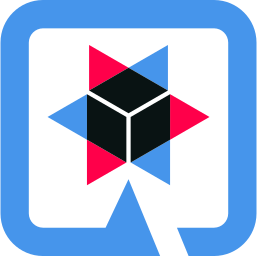

### Hello Everyone! 👋

This is Simmaco (Simone) Di Maio, self-motivated and self-taught not so famous (yet) Computer Scientist. I'm a ✨ Solution Architect and Developer ✨ with a great passion for Information Technology since 1991. 

I'm a technology enthusiast and appreciate the open source project for the deep insight of how things work. I'm working as a full time engineer in the mostly proprietary company of Telco, Public Sectors and industrial automation software. 

I study Computer Science at [#Unicas](https://www.unicas.it/). Previously, Electronic Engineering at [#UniNa](http://www.unina.it). 
In 1991 started coding in Borland [#TurboPascal](https://en.wikipedia.org/wiki/Turbo_Pascal), then in [#C](https://en.wikipedia.org/wiki/The_C_Programming_Language) and [#C++](https://en.wikipedia.org/wiki/The_C%2B%2B_Programming_Language). So, [#Basic](https://en.wikipedia.org/wiki/BASIC) and both, Motorola & Intel 8086 [#Assembly](https://en.wikipedia.org/wiki/Assembly) language.
Since 1999 until now I use [#Java](https://openjdk.java.net/) but I enjoy with [#Python](https://www.python.org/), [#go](https://go.dev/) and now [#RUST](https://www.rust-lang.org/).

- 📫 You can reach me on LinkedIn at: https://www.linkedin.com/in/simmaco-di-maio-6a272023/
- 📫 And on Twitter: https://twitter.com/sdimaio
- 📫 Visit my YouTube channel: https://www.youtube.com/channel/UC7dXAXj3Xe2ktoe3UIi997Q
- 💬 If you have some questions, please ask me on Facebook at: https://www.facebook.com/simmaco.dimaio

## My current toolbox

      
    
    
    <a href="https://quarkus.io/">
        
    
    </a>
    
    
    
    
 
      
    
    
    
    

 

### Programming languages and tools that I love
<code></code>
<code></code>
<code></code>
<code></code>
<code></code>
<code></code>
<code></code>
<code></code>
<code></code>
<i>Imperative</i>

<code></code>
<code></code>
<code></code>
<code></code>
<i>Declarative</i>

<code></code>
<code></code>
<code></code>
<i>Web</i>

<code></code>
<code></code>
<code></code>
<code></code>
<code></code>
<code></code>
<i>SQL databases</i>

<code></code>
<code></code>
<code></code>
<i>Operating systems</i>
***

Have a nice day!

# 

<!--  {  } -->

