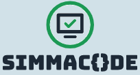

### Hello Everyone! 👋

I'm a ✨ Solution Architect and Developer ✨ with a great passion for Information Technology since 1991. 

I'm a technology enthusiast and appreciate the open source project for the deep insight of how things work. I'm working as a full time engineer in the mostly proprietary company of Telco, Public Sectors and industrial automation software. 

I study Computer Science at [#Unicas](https://www.unicas.it/). Previously, Electronic Engineering at [#UniNa](http://www.unina.it). 
In 1991 started coding in Borland [#TurboPascal](https://en.wikipedia.org/wiki/Turbo_Pascal), then in [#C](https://en.wikipedia.org/wiki/The_C_Programming_Language) and [C++](https://en.wikipedia.org/wiki/The_C%2B%2B_Programming_Language). So, [#Basic](https://en.wikipedia.org/wiki/BASIC) and both, Motorola & Intel 8086 [#Assembly](https://en.wikipedia.org/wiki/Assembly) language.
Since 1999 until now I use [#Java](https://openjdk.java.net/) but I enjoy with [#Python](https://www.python.org/), [#go](https://go.dev/) and now [#RUST](https://www.rust-lang.org/).

- 📫 You can reach me on LinkedIn at: https://www.linkedin.com/in/simmaco-di-maio-6a272023/
- 📫 And on Twitter: https://twitter.com/sdimaio
- 💬 If you have some questions, please ask me on Facebook at: https://www.facebook.com/simmaco.dimaio

Have a nice day!

# 
